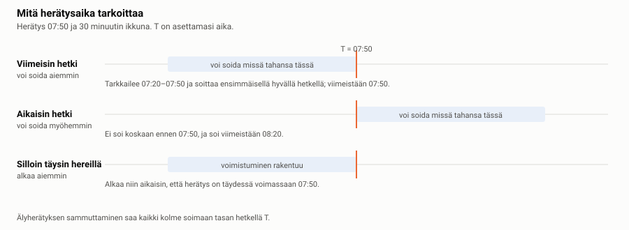
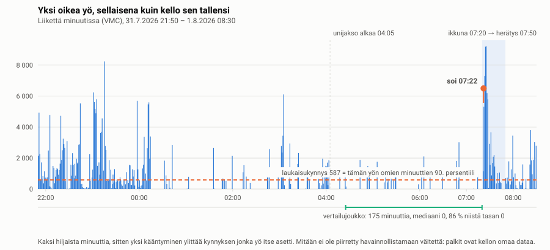
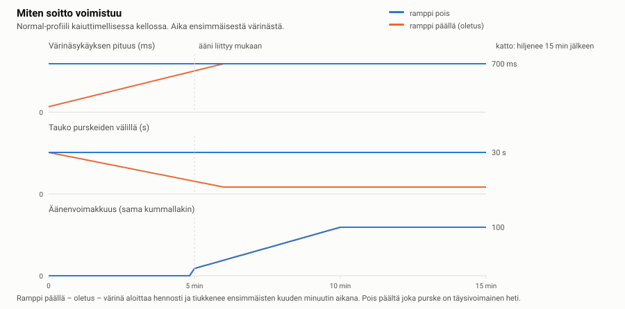
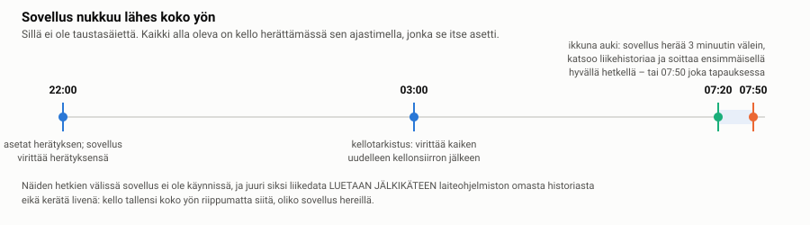

# Miten Sykerö Smart Alarm toimii

*In English: [how-it-works.md](how-it-works.md)*

Tämä kertoo, mitä sovellus oikeasti tekee — riittävän tarkasti, että voit ennustaa
sen käyttäytymisen ja olla siitä eri mieltä lukematta koodia. Teksti on kirjoitettu
herätyskellon käyttäjälle, ei sen ylläpitäjälle.

**Lupaus:** se soi. Kaikki fiksu tässä sovelluksessa on tavallisen herätyskellon
*edessä*: herätys soi asettamaanasi aikana, eikä mikään tässä voi siirtää sitä
myöhemmäksi. Jos liikedataa ei ole, kello ei ollut ranteessa, tai tunnistin ei
yksinkertaisesti löydä hyvää hetkeä, sinut herätetään silti herätysaikana.

Poikkeuksia on tasan yksi, ja se kannattaa tietää ennen kuin luotat tähän
sovellukseen: **jos akku laskee kellon omaan virransäästötilaan, mikään sovelluksen
herätys ei voi soida** — kello sammuttaa silloin palvelun, josta jokainen sovelluksen
herätys riippuu. Katso luku 5. Pidä kello ladattuna, tai aseta kellon sisäänrakennettu
herätys varmistukseksi yönä jolla on väliä.

---

## Lyhyesti

Asetat herätykset puhelimella. Kello säilyttää ne, ja vähän ennen herätystä se alkaa
seurata minuutti minuutilta kuinka paljon liikut. Kun se näkee sinun liikahtavan —
mitattuna sitä vasten, kuinka liikkumatta *sinä* olet ollut tänä yönä, ei kiinteää
lukua vasten — se soittaa silloin. Ajatuksena on, että kevyestä unesta herääminen on
helpompaa kuin syvästä unesta raahaaminen muutamaa minuuttia myöhemmin. Jos hyvää
hetkeä ei koskaan tule, herätysaika itse soittaa.

---

## 1. Mitä herätysaika tarkoittaa

Tämä kannattaa saada ensin oikein, koska kaikki kolme vastausta ovat järkeviä eikä
sovellus voi arvata kumpaa tarkoitit.

- **The latest — may ring earlier** (*viimeisin hetki*, oletus). Herätys 07:50
  tarkoittaa "ole hereillä 07:50 mennessä". Kello tarkkailee 07:20–07:50 ja soittaa
  ensimmäisellä hyvällä hetkellä.
- **The earliest — may ring later** (*aikaisin hetki*). 07:50 tarkoittaa "älä herätä
  minua ennen 07:50". Kello tarkkailee 07:50–08:20 ja soittaa viimeistään 08:20.
- **When I must be fully awake** (*silloin täysin hereillä*). 07:50 on hetki, jolloin
  herätyksen pitää olla *täydessä voimassaan*, joten voimistuminen alkaa niin
  aikaisin että se on siihen mennessä kehittynyt.

Älyherätyksen sammuttaminen saa kaikki kolme soimaan tasan asettamanasi aikana.

Ikkunan pituus (10–60 minuuttia, oletus 30) on se mitä "vähän ennen" tarkoittaa, ja
se on sovelluksen keskeisin vaihtokauppa: pidempi ikkuna antaa tunnistimelle enemmän
tilaisuuksia löytää kevyen unen hetki, ja luovuttaa enemmän aamustasi sen tekemiseen.

---

## 2. Mitä kello mittaa

Kellon terveyspalvelu tallentaa jokaiselta vuorokauden minuutilta **VMC**-luvun
("vector magnitude count", karkeasti kuinka paljon ranne liikkui sen minuutin aikana)
sekä karkean **asennon** (mihin suuntaan ranne osoittaa). Tämä tapahtuu koko ajan,
riippumatta siitä onko tämä sovellus käynnissä — ja juuri se tekee koko ratkaisun
mahdolliseksi: sovellus voi nukkua koko yön ja lukea silti koko yön jälkikäteen.

Tässä on oikea yö, täsmälleen sellaisena kuin kello sen tallensi — alla oleva data ei
ole havainnekuva, vaan yhden yön minuutit tekijän omasta kellosta:

### Kynnys rakennetaan sinun omasta yöstäsi

Ei ole olemassa kiinteää "tämä määrä liikettä tarkoittaa hereillä oloa". Se mikä
lasketaan liikahdukseksi riippuu täysin siitä, kuinka liikkumatta olet ollut:

1. **Etsi mistä uni alkoi.** Käytetään kellon omaa unijaksoa jos sellainen on;
   muuten sovellus etsii ensimmäisen pitkän hiljaisen jakson. Sen jälkeiset ensimmäiset
   **20 minuuttia** heitetään pois — nukahtaminen ei edusta yötä.
2. **Ota kaikki siitä eteenpäin ikkunan alkuun asti** — ja *vain* ikkunan alkuun asti.
   Ikkuna on se mitä arvioidaan, joten sen päästäminen omaan vertailujoukkoonsa
   nostaisi rimaa joka kerta kun liikahdat.
3. **Pudota valvejaksot pois.** Mikä tahansa **vähintään 8 peräkkäisen minuutin**
   jakso, joka ylittää 4 × lepomediaanin (plus pieni kiinteä marginaali), ei ole unta
   vaan sinua hereillä — ja se poistetaan kokonaan. Yksi levoton tunti asettaisi
   muuten kynnyksen niin korkealle, ettei mikään myöhempi yöllä voisi ylittää sitä.
   Lyhyet purskeet säilytetään: tavallinen kääntyminen on dataa, ei poikkeama.
4. **Ota jäljelle jäävistä persentiili.** Se on **laukaisukynnys**. Yllä olevana yönä
   vertailujoukko oli 175 minuuttia, joista 86 % tasan nollia, ja 90. persentiiliksi
   tuli **587**.

Seuraus kannattaa sanoa suoraan: **hyvin rauhallisena yönä kynnys on matala, ja
tavallinen kääntyminen ylittää sen.** Se on suunnittelu toiminnassa, ei häiriö — mutta
se tarkoittaa, että rauhallinen nukkuja herätetään lähempänä ikkunan alkua kuin
levoton.

### Sekä voimakkuus että kesto

Kynnyksen ylittäminen yhden minuutin ajan ei riitä. Jokaisella ikkunan sisällä olevalla
minuutilla kertymä saa:

- **ylityksen**, jos minuutin liike on laukaisukynnyksen yläpuolella, ja
- **bonuksen 400**, jos ranne on kääntynyt — sen asento poikkeaa edeltävien kymmenen
  minuutin liukuvasta moodista vähintään 2 askelta 16:sta.

Minuutti joka ei tuota kumpaakaan **nollaa kertymän**. Herätys laukeaa kun kertymä on
saavuttanut yhden täyden laukaisukynnyksen *ja* tuottavien minuuttien sarja on
riittävän pitkä (1–5 minuuttia, oletus 2). Yksi piikki — yskäisy, kellon kolahdus
sängynpäätyyn — ei siis voi soittaa sitä, oli se kuinka suuri tahansa.

Erillistä vaimennusvakiota ei ole: koska sarja nollautuu millä tahansa hiljaisella
minuutilla, kertymä valuu tyhjäksi itsestään.

### Kaksi estoa

- **Jos laiteohjelmisto sanoo että olet juuri nyt syvässä unessa**, aikainen herätys
  estetään. Takaraja pätee silti.
- **Jos käyttökelpoisia minuutteja on alle 60**, joista rakentaa jakauma, älyherätys
  vetäytyy kokonaan ja herätysaika soittaa. Kello sanoo *"smart alarm unavailable"*
  sen sijaan että esittäisi tietävänsä.

### Herkkyys (Sensitivity)

Ainoa asia jonka tämä asetus muuttaa on se, mistä persentiilistä tulee laukaisukynnys:

| Asetus | Persentiili | Vaikutus |
|---|---|---|
| Low — only a clear stir | 95 | Laukeaa harvoin; sinut herättää todennäköisemmin herätysaika itse |
| **Medium** *(oletus)* | 90 | |
| High — the slightest stir | 82 | Laukeaa aikaisin ja usein |
| Custom | oma valinta, 70–99 | Antaa asettaa myös vaaditun keston, 1–5 minuuttia |

Kellon **Last night** -näyttö on olemassa juuri siksi, että tämän voi päättää eikä
arvata: se kertoo mikä laukaisukynnys oli, milloin herätys todella laukesi, ja
**milloin kukin muu herkkyys olisi laukaissut samana yönä**. Jos Low sanoo `--:--`,
se ei olisi laukaissut lainkaan — sinut olisi herättänyt herätysaika.

---

## 3. Miten se herättää sinut

Soitto on sarja **purskeita** — muutama värinäsykäys, sitten tauko, ja uudestaan. Ääni
liittyy mukaan myöhemmin, jos kellossa on kaiutin (vain osassa malleista on).

**Oletuksena värinä ei voimistu.** Se on täydellä voimalla ensimmäisestä purskeesta
lähtien, tasavälein, ja vain ääni voimistuu. Tämä on tarkoituksellista, ja perustelu
on turvallisuus eikä maku: toistuva liian hento ärsyke opettaa nukkujan sivuuttamaan
sen kanavan, ja heikentää myös sen jälkeen tulevia voimakkaampia sykäyksiä. Asetus
**"Ramp the vibration up"** palauttaa hennon aloituksen, joka tiukkenee muutaman
minuutin kuluessa.

**Wake style** -esiasetukset eroavat toisistaan tauon pituudessa, siinä kuinka kauan
soitto kestää ennen luovuttamista, milloin ääni liittyy mukaan ja kuinka kovaa siitä
tulee:

| Tyyli | Tauko purskeiden välillä | Ääni mukaan | Enimmäisvoimakkuus | Luovuttaa |
|---|---|---|---|---|
| Gentle | 45 s | 8 min | 70 | 20 min |
| **Normal** *(oletus)* | 30 s | 5 min | 100 | 15 min |
| Insistent | 15 s | 1 min | 100 | 15 min |
| Custom | kaikki kaksitoista lukua ovat omiasi | | | |

Kun soitto luovuttaa, se lakkaa pitämästä ääntä mutta jättää näytölle
**"Alarm missed"**, jotta aamu kertoo mitä tapahtui.

### Pysäyttäminen ja torkku

Soittoruudulla: **UP torkuttaa**, ja **kaksi painallusta alanappia pysäyttää**. Yksi
painallus ei koskaan pysäytä herätystä — puoliunessa oleva käsi löytää yhden napin
tunnustelemalla, ja juuri niin herätys tulee vahingossa kuitatuksi.

Torkku on oletuksena 10 minuuttia ja niitä sallitaan 5; kun ne loppuvat, torkkunappi
toimii pysäytyksenä sen sijaan että muuttuisi tehottomaksi. **Jokainen torkku
aloittaa voimistumisen alusta.** (Voit muuttaa tämän: *"each snooze starts this far
along"* -liu'un nostaminen saa toisen herätyksen jatkamaan pidemmältä rampista — eli
alkamaan voimakkaampana kuin ensimmäinen.)

---

## 4. Kellon näytöt

Herätykset asetetaan puhelimella. Kellossa on kolme näyttöä eikä mitään tapaa luoda
herätysaikaa — tarkoituksella, koska puhelimen näppäimistö voittaa neljä nappia.

**Valikko** — seuraava herätys ja kuinka kaukana se on, herätyslista, "Last night",
sekä Test alarm joka soi kahden minuutin päästä, jotta voit tuntea asetuksesi
odottamatta aamua.

**Herätyslista** — jokainen herätys ja sen tila sanoin (`in 23 h`, `skip, in 1 d`,
`off`). SELECT-painallus avaa pienen valikon, joka kirjoittaa auki mitä se tekee:
*Skip Mon 07:50* (vain tämä yksi kerta), *Turn off*, *Turn on*.

**Odotusnäyttö** — näkyy ikkunan ollessa auki, valkoisena mustalla jottei se ole
taskulamppu naamaan kello kolme yöllä. Siltä pääsee pois kahdella tavalla, ja
molemmat vaativat kaksi painallusta jottei kumpikaan tapahdu vahingossa:

- **DOWN kahdesti — peruu herätyksen.** Se ei soi, eikä se palaa.
- **BACK kahdesti — vie kellotaululle.** Ikkuna jää auki, joten näyttö palaa noin
  kolmen minuutin kuluessa.

**Soittonäyttö** — kellonaika, herätys, ja miten se pysäytetään.

---

## 5. Milloin sovellus on oikeasti käynnissä

Pebble-sovelluksilla ei ole taustasäiettä: kerrallaan käy vain yksi sovellus, ja
kellotaulu on niistä yksi. Tämä sovellus *ei siis ole käynnissä* lähes koko yönä. Se
toimii pyytämällä kelloa herättämään itsensä tiettyinä hetkinä:

- **ikkunan avautuessa**, ja sen jälkeen kolmen minuutin välein ikkunan ollessa auki,
- **herätysaikana**, takarajana joka on aina laukeava,
- **kerran yössä klo 03:00**, pelkästään virittääkseen kaiken uudelleen mahdollisen
  kesäaikasiirtymän jälkeen.

Juuri siksi liikedata luetaan jälkikäteen laiteohjelmiston omasta historiasta eikä
näytteistetä livenä — ja siksi sovellus selviää siitä että se tapetaan, kello
käynnistyy uudelleen tai avaat jotain muuta: ajastetut herätykset ovat kellon
tallentamia, eivät sovelluksen muistissa. Se tarkoittaa myös, että kun sovellus *ei*
ole käynnissä, se katsoo liikettäsi kolmen minuutin välein eikä joka minuutti.

### Mikä voi silti mennä pieleen

| Tilanne | Mitä tapahtuu |
|---|---|
| Kello pois ranteesta, tai aktiivisuusseuranta pois päältä | Ei käyttökelpoista dataa → "smart alarm unavailable", herätysaika soittaa |
| Kello sammutettu herätyksen yli | Herätys jää väliin; kello kertoo siitä käynnistyessään |
| Puhelin poissa tai Bluetooth pois | Ei vaikutusta. Herätykset elävät kellossa; puhelinta tarvitaan vain niiden muokkaamiseen |
| Quiet Time päällä | **Ei vaikutusta värinään** — tämä on herätyskello, ja se sivuuttaa Quiet Timen tarkoituksella. Ääni voidaan silti vaimentaa, jos olet laittanut päälle "mute speaker during Quiet Time" |
| Akku riittävän tyhjä kellon virransäästötilaan | **Herätys ei voi soida.** Siinä tilassa kello sammuttaa ajastinherätyspalvelun kokonaan, ja jokainen sovelluksen herätys — tämä mukaan lukien — riippuu siitä. Kellon *sisäänrakennettu* herätys toimii yhä, koska se on kytketty selviämään tuosta tilasta eikä sovellus voi olla. Lataa kello, tai aseta sisäänrakennettu herätys varmistukseksi yönä jolla on väliä |

---

## 6. Jokainen asetus ja mitä se oikeasti muuttaa

*Custom*-merkityillä on merkitystä vain jos olet asettanut vastaavan valitsimen
Custom-tilaan; muuten esiasetus antaa nuo luvut.

### Alarms

| Asetus | Oletus | Mitä se muuttaa |
|---|---|---|
| Alarm list | yksi 07:00 herätys | Enintään 8 herätystä, kullakin aika, viikonpäivät ja on/off-kytkin |

### Smart alarm

| Asetus | Oletus | Mitä se muuttaa |
|---|---|---|
| Smart alarm | päällä | Pois päältä saa jokaisen herätyksen soimaan tasan aikanaan, eikä mikään alla olevasta merkitse mitään |
| Smart window length | 30 min | Kuinka paljon aamustasi tunnistin saa käyttää |
| The alarm time is | the latest | Kummalle puolelle herätysaikaa ikkuna asettuu — katso luku 1 |
| Sensitivity | Medium | Mistä oman yösi persentiilistä tulee laukaisukynnys |
| *Custom:* stir percentile | 90 | Persentiili itse, 70–99 |
| *Custom:* sustained for | 2 min | Kuinka monta peräkkäistä tuottavaa minuuttia vaaditaan |

### How it wakes you

| Asetus | Oletus | Mitä se muuttaa |
|---|---|---|
| Ramp the vibration up | **pois** | Päällä: hento aloitus joka tiukkenee. Pois: täysi voima ensimmäisestä purskeesta |
| Wake style | Normal | Esiasetus kaikille kahdelletoista alla olevalle luvulle |
| *Custom:* gap between buzzes | 30 s | Hiljaisuus purskeiden välillä alussa |
| *Custom:* final gap | 5 s | Hiljaisuus purskeiden välillä täysin voimistuneena (saavutettavissa vain ramppi päällä) |
| *Custom:* tighten over | 360 s | Kuinka kauan voimistuminen kestää (vain ramppi päällä) |
| *Custom:* first pulse | 80 ms | Sykäyksen pituus alussa (vain ramppi päällä) |
| *Custom:* pulse length | 700 ms | Sykäyksen pituus voimistuneena — ja heti ensimmäisestä purskeesta kun ramppi on pois |
| *Custom:* first burst pulses | 1 | Sykäyksiä purskeessa alussa (vain ramppi päällä) |
| *Custom:* pulses per buzz | 3 | Sykäyksiä purskeessa voimistuneena — ja heti ensimmäisestä purskeesta kun ramppi on pois |
| *Custom:* sound joins after | 300 s | Milloin ääni alkaa. **Ei vaikutusta kellossa jossa ei ole kaiutinta** |
| *Custom:* volume ramp | 300 s | Kuinka kauan voimakkuudella kestää saavuttaa maksiminsa. Vain kaiuttimellinen |
| *Custom:* first volume | 15 | Voimakkuus kun ääni liittyy mukaan. Vain kaiuttimellinen |
| *Custom:* max volume | 100 | Kovin mihin se yltää. Vain kaiuttimellinen |
| *Custom:* give up after | 900 s | Kuinka kauan soitto kestää ennen kuin se lakkaa pitämästä ääntä |

### Snooze and stopping

| Asetus | Oletus | Mitä se muuttaa |
|---|---|---|
| Snooze length | 10 min | Off poistaa torkun kokonaan (nappi pysäyttää silloin herätyksen) |
| Snoozes allowed | 5 | Unlimited on sallittu; soitto ei koskaan hiljene sen takia |
| Each snooze starts this far along | 0 s | 0 aloittaa voimistumisen alusta joka kerta. Suurempi arvo saa jokaisen torkun alkamaan voimakkaampana |

---

## 7. Mitä se tarkoituksella jättää tekemättä

- **Se ei kunnioita Quiet Timea.** Herätyskello on olemassa soidakseen silloin kun
  kello on muuten hiljaa. Kellon oma rajapinta kutsuu tuota asetusta neuvoksi;
  herätyskellolle oikea vastaus on sivuuttaa se.
- **Se ei luokittele univaiheita.** Täällä ei ole REM/syvä/kevyt-mallia. Se mittaa
  liikettä, joka korreloi unen syvyyden kanssa riittävän hyvin hetken valitsemiseen,
  ja se sanoo niin sen sijaan että pukisi asian hienommaksi.
- **Se ei käytä kiihtyvyysanturia suoraan.** Se vaatisi sovelluksen olevan käynnissä
  koko yön, mitä Pebble ei salli eikä akkusi kestäisi. Laiteohjelmiston oma
  minuuttihistoria on sekä halvempi että kattavampi.
- **Se ei luo herätyksiä kellossa**, kahden minuutin Test alarmia lukuun ottamatta.

---

## Liite — mistä luvut ovat peräisin

Yökaavio on oikeaa dataa, ja sen voi tarkistaa: `img/night-2026-08-01.txt` sisältää
ne 640 minuuttikohtaista arvoa jotka kello tallensi, ja `img/make_diagrams.py`
piirtää jokaisen tämän dokumentin kaavion uudelleen tuosta tiedostosta ja
lähdekoodin vakioista. Kaavioon piirretty kynnys (587) on se minkä kello itse laski
ja kirjasi sinä aamuna, ja 90. persentiilin laskeminen uudelleen julkaistusta
datasta tuottaa täsmälleen saman luvun.

Asetusten nimet on jätetty englanniksi, koska puhelimen asetussivu on englanniksi:
näin nimi jonka luet täältä on sama jonka näet puhelimessa.
