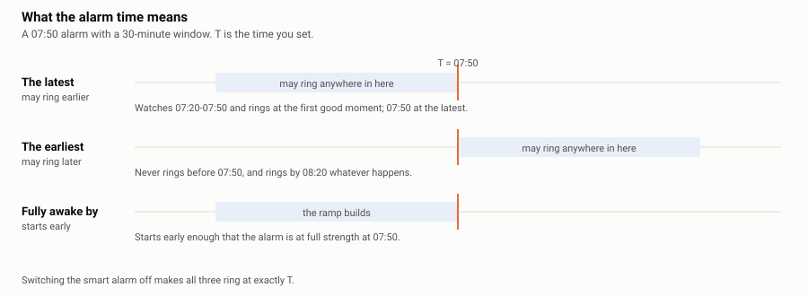
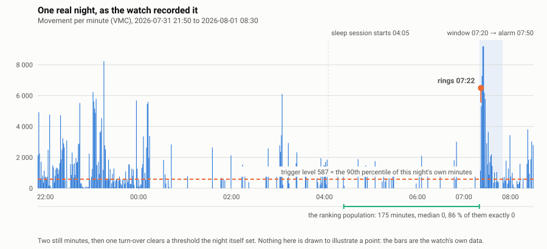
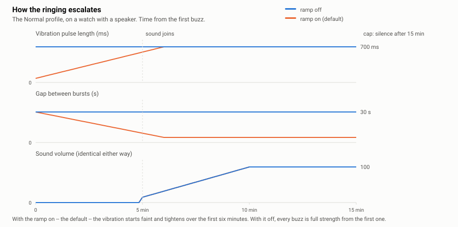
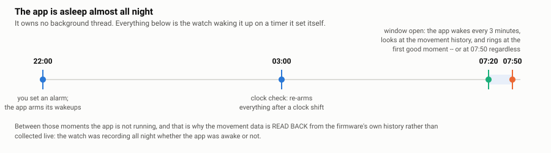

# How Sykerö Smart Alarm works

*Suomeksi: [how-it-works.fi.md](how-it-works.fi.md)*

This describes what the app actually does, in enough detail that you can predict
its behaviour — and argue with it — without reading the code. It is written for
someone using the alarm, not maintaining it.

**The promise:** it rings. Everything clever in here sits *in front of* an ordinary
alarm that goes off at the time you set, and none of it can push that time back. If
the movement data is missing, the watch was off your wrist, or the detector simply
never finds a good moment, you still get woken at your alarm time.

There is exactly one exception, and it is worth knowing before you rely on this app:
**if the battery drops far enough for the watch's own low-power mode, no app alarm
can ring** — the watch switches off the service every app alarm depends on. See
§5. Charge the watch, or keep a built-in alarm as a backstop on a night that matters.

---

## The short version

You set alarms on your phone. The watch keeps them, and shortly before an alarm is
due it starts watching how much you move, minute by minute. When it sees you stir —
measured against how still *you* have been tonight, not against a fixed number — it
rings then, on the theory that waking out of light sleep is easier than being
dragged out of deep sleep a few minutes later. If it never sees a good moment, the
alarm time itself rings it.

---

## 1. What the alarm time means

This is the first thing to get right, because all three answers are reasonable and
the app cannot guess which one you meant.

- **The latest — may ring earlier.** *(default)* A 07:50 alarm means "have me up by
  07:50". The watch watches 07:20–07:50 and rings at the first good moment.
- **The earliest — may ring later.** 07:50 means "don't wake me before 07:50". The
  watch watches 07:50–08:20 and rings by 08:20 at the latest.
- **When I must be fully awake.** 07:50 is the moment the alarm should be at *full
  strength*, so the ramp starts early enough to have developed by then.

Switching the smart alarm off makes all three ring at exactly the time you set.

The window length (10–60 minutes, default 30) is what "shortly before" means, and
it is the app's central trade: a longer window gives the detector more chances to
find a light-sleep moment, and gives up more of your morning to do it.

---

## 2. What the watch measures

The watch's health service records, for every minute of the day, a **VMC** — a
"vector magnitude count", roughly how much the wrist moved that minute — plus a
coarse **orientation** (which way the wrist is facing). This happens all the time,
whether or not this app is running, which is what makes the whole design possible:
the app can be asleep all night and still read the whole night back when it wakes.

Here is a real night, exactly as the watch recorded it — the data below is not an
illustration, it is a dump of one night's minutes off the author's own watch:

### The threshold is built from your own night

There is no fixed "this much movement means awake". What counts as a stir depends
entirely on how still you have been:

1. **Find where sleep started.** The watch's own sleep session is used when it has
   one; otherwise the app looks for the first long quiet stretch. The first
   **20 minutes** after that are thrown away — falling asleep is not representative
   of the night.
2. **Take everything from there up to the start of the window** — and *only* up to
   the start of the window. The window is what is being judged, so letting it into
   its own reference population would raise the bar every time you stirred.
3. **Drop wake episodes.** Any run of **8 or more consecutive minutes** above
   4 × the resting median (plus a small fixed margin) is not sleep — it is you
   being awake — and it is removed
   entirely. A single restless hour would otherwise set a threshold so high that
   nothing later in the night could clear it. Short bursts are kept: an ordinary
   turn-over is data, not an outlier.
4. **Take a percentile of what remains.** That is the **trigger level**. On the
   night above, the population was 175 minutes, 86 % of them exactly zero, and the
   90th percentile came out at **587**.

The consequence is worth stating plainly: **on a very still night the threshold is
low, and an ordinary turn-over will clear it.** That is the design working, not
misfiring — but it does mean a still sleeper gets woken nearer the start of the
window than a restless one.

### Magnitude *and* duration

Clearing the threshold for one minute is not enough. Each minute inside the window,
an accumulator gets:

- **the excess**, if the minute's movement is above the trigger level, and
- **a bonus of 400**, if the wrist has turned over — its orientation differs from
  the rolling mode of the preceding ten minutes by at least 2 of 16 steps.

A minute that contributes neither **resets the accumulator to zero**. The alarm
fires when the accumulator has reached one full trigger level *and* the run of
contributing minutes is long enough (1–5 minutes; 2 by default). So a single spike —
a cough, the watch knocking the headboard — cannot ring it, however large.

There is no separate decay constant: because the run resets on any quiet minute,
the accumulator drains by construction.

### Two vetoes

- **If the firmware says you are in deep sleep right now**, an early wake is
  refused. The deadline still applies.
- **If there are fewer than 60 usable minutes** to build a distribution from, the
  smart alarm stands down entirely and the alarm time rings it. The watch says
  *"smart alarm unavailable"* rather than pretending.

### Sensitivity

The only thing this setting changes is which percentile becomes the trigger level:

| Setting | Percentile | Sustained for | Effect |
|---|---|---|---|
| Low — only a clear stir | 95 | 2 min | Fires rarely; you are more likely to be woken by the alarm time itself |
| **Medium** *(default)* | 90 | 2 min | |
| High — the slightest stir | 82 | 2 min | Fires early and often |
| Custom | your choice, 70–99 | your choice, 1–5 min | The only way to change the sustained-for length |

The **Last night** screen on the watch exists to make this decidable rather than
guessy: it shows what the trigger level was, when the alarm actually fired, and
**when each of the other sensitivities would have fired on the same night**. If
Low says `--:--`, it would not have fired at all — you would have been woken by
the alarm time.

---

## 3. How it wakes you

A ring is a series of **bursts** — a few vibration pulses, then a gap, repeat. Sound
joins later, if the watch has a speaker (only some models do).

**By default the vibration ramps up.** It starts as a faint tap and tightens over
several minutes, at a constant gap, and the sound ramps too. Turning **"Ramp the
vibration up"** off makes the vibration full strength from the very first buzz
instead, leaving only the sound to ramp.

Which of the two wakes you better is a preference, and worth trying both ways. The
one argument on record for the flat version is that a repeated faint stimulus
*might* train a sleeper to sleep through that channel, and through the stronger
pulses after it — reasoning rather than a measurement, and the setting exists so a
sleeper who does find that happening can switch it off.

The **wake style** presets differ in gap, how long the ring lasts before it gives
up, when sound joins, and how loud it gets:

| Style | Gap between buzzes | Sound joins | Max volume | Gives up after |
|---|---|---|---|---|
| Gentle | 45 s | 8 min | 70 | 20 min |
| **Normal** *(default)* | 30 s | 5 min | 100 | 15 min |
| Insistent | 15 s | 1 min | 100 | 15 min |
| Custom | all twelve numbers are yours | | | |

(All twelve, side by side, are in §6 — the presets differ less than their names
suggest.)

When the ring gives up, it stops making noise but leaves **"Alarm missed"** on the
screen, so the morning tells you what happened.

### What the ringing screen shows

Under the clock and the two button labels, the bottom line reports the night that
led here: `Slept 1.7/6.5 h` — restful hours of total hours, the same two figures
the watch's own health data and TimeStyle's sleep widget report. The snooze screen
carries the same line, above its clock instead of below the buttons. When the watch
has recorded no sleep at all — health switched off, or a night it never saw — the
line is absent rather than showing zeros.

### Stopping and snoozing

On the ringing screen, **both buttons need two presses**: the top button
(*Snooze*, with the length it grants on a small line under it — `10 min`) twice
snoozes, the bottom button (*Stop*) twice stops it. One press
never does either — it only shows what the second press would do (`Press 2x to
snooze` / `Press 2x to stop`) — because a half-asleep hand finds one button by
feel, and that is exactly how an alarm used to get dismissed, or snoozed, by
accident.

A snooze no longer drops you back to the watchface. Instead the watch keeps a
screen up: the clock, `Snooze 1` (which snooze this is), and `Rings again 09:40`
(when it will sound again), with a permanent two-line reminder underneath —
`2x Back: watchface` and `2x Down: cancel alarm`. **Two presses of DOWN cancel
the alarm outright** — it will not ring again tonight. Two presses of BACK just
leave this screen for the watchface; the snooze is still armed, and the alarm
comes back on its own when it ends. Close the app entirely while snoozed (BACK
twice, or the button-hold that closes any app on this watch) and opening it
again brings this same screen straight back, not the menu. While a snooze is
pending, both the main menu and the alarm list say so in words too — `snoozed,
in 4 min` — so you never have to wonder.

Snooze is 10 minutes by default, 5 snoozes maximum. **Each snooze restarts the
escalation from the beginning.** (You can change that: raising *"each snooze starts
this far along"* makes a second alarm pick up further along the ramp — i.e. start
stronger than the first one did.)

**The middle button offers a different snooze length**, also on the second press:
a menu of 5, 10, 15, 20, 30, 45 or 60 minutes, marked on the screen by a small `+`
at that button's height. Once the menu is open, choosing acts on a single press —
opening it was the deliberate act, and a confirmation inside a menu you had to
double-press to reach would be ceremony. A length chosen this way is a one-off: the
top button still means whatever you configured on the phone.

When the snoozes run out — or snoozing is switched off on the phone entirely —
the top and middle buttons both go inert, and the screen says so: the `Snooze`
label, its length line and the `+` all disappear, leaving `Stop` alone on the
screen. Two reasons.
A button that cannot do anything must not be advertised as if it could; and the
top button must never quietly become a second Stop, because then a double-press
meant to buy a few more minutes would switch the whole alarm off instead.

---

## 4. The screens on the watch

Alarms are set on the phone. The watch shows state and offers quick actions, and has
no way to create an alarm time — deliberately, since a phone keyboard beats four
buttons.

**The menu** — the next alarm and how far away it is, the alarm list, "Last night",
and a Test alarm that rings two minutes from now so you can feel your settings
without waiting for morning.

**The alarm list** — every alarm with its state in words (`in 23 h`, `skip, in 1 d`,
`off`). Pressing SELECT on one opens a small menu that spells out what it will do:
*Skip Mon 07:50* (this one occurrence only), *Turn off*, *Turn on*.

**The waiting screen** — shown while the window is open, white on black so it is not
a torch in the face at 3 a.m. Two ways off it, both needing two presses so neither
happens by accident:

- **DOWN twice — cancel the alarm.** It will not ring, and it will not come back.
- **BACK twice — go to the watchface.** The window stays open, so the screen
  returns within about three minutes.

**The pre-alarm screen** — the same screen, the same buttons, up to 90 minutes
earlier. Set *"show alarm screen before"* on the phone (Off, 15, 30, 60 or 90
minutes; an hour by default) and the watch puts the waiting screen up that long
before the alarm. The point is the morning you wake by yourself at 06:40: instead of
lying there waiting for the alarm, or hunting through menus in the dark, the screen
is already there and two presses of DOWN end it. It says which alarm it is waiting
for, and when the two differ it names both instants — `Alarm 07:00` above `Rings by
07:30` — so it never announces a time the alarm is not.

Three things about it are deliberate. It **does not start the smart window** — no
movement is being measured yet, and the alarm's own wakeups are untouched. It works
with **the smart alarm switched off**, where it is the only screen you get before the
ring. And **BACK twice leaves for good**: unlike the waiting screen, which is
monitoring something and comes back within three minutes, this one is not, so
dismissing it means "leave me alone until the alarm is actually near" rather than
having the app push itself in front of you thirty times over ninety minutes. The
alarm itself stays armed either way.

**The ringing screen** — the time, the alarm, and how to stop it (see §3).

---

## 5. When the app is actually running

Pebble apps have no background thread: only one app runs at a time, and the
watchface counts as one. This app is therefore *not running* for almost the whole
night. It works by asking the watch to wake it at specific moments:

- **at the window opening**, and then every three minutes while the window is open,
- **at the alarm time**, as the deadline that must always fire,
- **once a night at 03:00**, purely to re-arm everything after a possible
  daylight-saving shift.

This is why the movement data is read back from the firmware's own history rather
than sampled live — and why the app survives being killed, the watch rebooting, or
you opening something else: the wakeups are stored by the watch, not held in the
app's memory. It also means that when the app is *not* running, it looks at your
movement every three minutes rather than every minute.

### What can still go wrong

| Situation | What happens |
|---|---|
| Watch off your wrist, or activity tracking off | No usable data → "smart alarm unavailable", the alarm time rings |
| Watch switched off over the alarm | The alarm is missed; the watch reports it when it boots |
| Phone away or Bluetooth off | No effect. Alarms live on the watch; the phone is only for editing them |
| Quiet Time on | **No effect on the vibration** — this is an alarm, and it deliberately ignores Quiet Time. Sound can still be silenced if you have switched on "mute speaker during Quiet Time" |
| Battery low enough for the watch's low-power mode | **The alarm cannot ring.** In that mode the watch switches its wakeup service off entirely, and every app alarm — this one included — depends on it. The watch's *built-in* alarm keeps working, because it is wired to survive that mode and an app cannot be. Charge the watch, or set a built-in alarm as a backstop on a night that matters |

---

## 6. Every setting, and what it actually changes

Sections marked *Custom* only matter if you have set the corresponding picker to
Custom; otherwise the preset supplies those numbers.

### Alarms

| Setting | Default | What it changes |
|---|---|---|
| Alarm list | one 07:00 alarm | Up to 8 alarms, each with a time, weekdays, and an on/off switch |

### Smart alarm

| Setting | Default | What it changes |
|---|---|---|
| Smart alarm | on | Off makes every alarm ring exactly at its time and nothing below matters |
| Smart window length | 30 min | How much of your morning the detector is allowed to use |
| Show alarm screen before | 60 min | How long before the alarm the waiting screen opens, so you can end it with two presses if you wake early. Off disables it. **Independent of the smart alarm** — it works with it off, and it never makes the alarm ring earlier |
| The alarm time is | the latest | Which side of the alarm time the window sits on — see §1 |
| Sensitivity | Medium | Which percentile of your own night becomes the trigger level |
| *Custom:* stir percentile | 90 | The percentile itself, 70–99 |
| *Custom:* sustained for | 2 min | How many consecutive contributing minutes are required |

### How it wakes you

| Setting | Default | What it changes |
|---|---|---|
| Ramp the vibration up | **on** | On: a gentle start that tightens. Off: full strength from the first buzz |
| Wake style | Normal | A preset for all twelve numbers below |

**A "wake style" is exactly these twelve numbers**, and choosing Custom starts you
from the Normal column. Seeing them side by side is also the quickest way to
understand what the presets really differ in:

| *Custom* setting | Gentle | **Normal** | Insistent | What it changes |
|---|---|---|---|---|
| gap between buzzes | 45 s | 30 s | 15 s | Silence between bursts at the start |
| final gap | 10 s | 5 s | 3 s | Silence between bursts once fully ramped (only reachable with the ramp on) |
| tighten over | 600 s | 360 s | 180 s | How long the ramp takes (only with the ramp on) |
| first pulse | 60 ms | 80 ms | 200 ms | Pulse length at the start (only with the ramp on) |
| pulse length | 500 ms | 700 ms | 700 ms | Pulse length once fully ramped — and from the very first buzz with the ramp off |
| first burst pulses | 1 | 1 | 2 | Pulses per burst at the start (only with the ramp on) |
| pulses per buzz | 3 | 3 | 3 | Pulses per burst once ramped — and from the first buzz with the ramp off |
| sound joins after | 480 s | 300 s | 60 s | When sound starts. **No effect on a watch without a speaker** |
| volume ramp | 300 s | 300 s | 180 s | How long volume takes to reach its maximum. Speaker only |
| first volume | 10 | 15 | 30 | Volume when sound joins. Speaker only |
| max volume | 70 | 100 | 100 | Loudest it gets. Speaker only |
| give up after | 1200 s | 900 s | 900 s | How long the ring lasts before it stops making noise |

Read down the columns and the presets are less different than their names suggest —
especially with the ramp off, which switches off the four rows marked *only with the
ramp on* and makes every buzz start at the "pulse length" and "pulses per buzz"
values. On a watch without a speaker, four more rows do nothing, and Gentle versus
Normal comes down to 45 s versus 30 s between identical full-strength buzzes.

### Snooze and stopping

| Setting | Default | What it changes |
|---|---|---|
| Snooze length | 10 min | What the top button means: 5, 10, 15, 20, 30, 45 or 60 min — the same lengths the middle button's menu offers. Off disables snoozing entirely — the top and middle buttons then do nothing, and only the bottom button (Stop) can end the ring |
| Total snooze time | 30 min | How many MINUTES of snoozing are allowed in total before the top and middle buttons go inert too, however many presses that takes — not a count of presses. Unlimited is allowed; the ring never goes silent because of it. The middle button's menu only offers lengths that still fit the remaining time |
| Each snooze starts this far along | 0 s | 0 restarts the ramp each time. Higher makes each snooze start stronger |

---

## 7. What it deliberately does not do

- **It does not respect Quiet Time.** An alarm exists to ring while the watch is
  otherwise silent. The watch's own API calls that setting advisory; for an alarm
  the right answer is to ignore it.
- **It does not stage sleep.** There is no REM/deep/light model here. It measures
  movement, which correlates with sleep depth well enough to pick a moment, and it
  says so rather than dressing it up.
- **It does not use the accelerometer directly.** That would need the app running
  all night, which Pebble does not allow and your battery would not survive. The
  firmware's own minute history is both cheaper and more complete.
- **It does not create alarms on the watch**, apart from the two-minute Test alarm.

---

## Appendix — where the numbers came from

The night chart is real data, and it can be checked: `img/night-2026-08-01.txt` is
the 640 per-minute values the watch recorded, and `img/make_diagrams.py` redraws
every diagram in this document from that file plus the constants in the source. The
threshold drawn on the chart (587) is what the watch itself computed and recorded
that morning, and recomputing the 90th percentile from the published data
reproduces it exactly.
